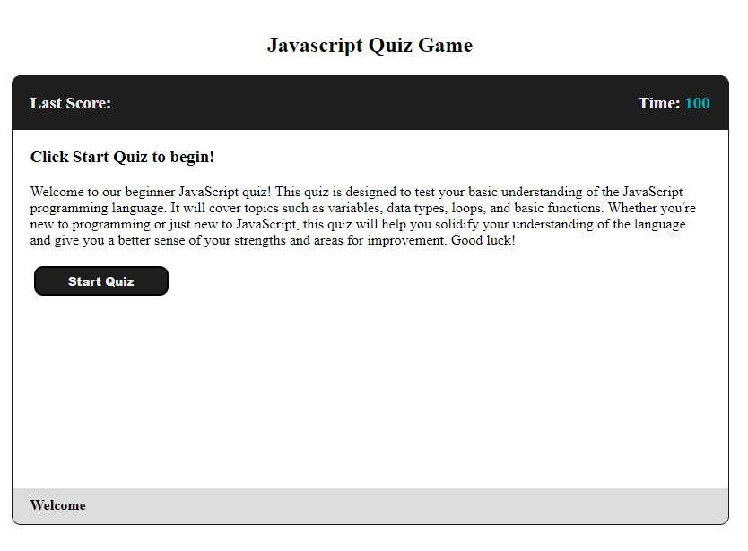

# Javascript Knowledge Quiz

In this quiz, you will be asked 10 random beginner javascript questions to test your knowledge. Game starts with 100 seconds on the clock (10 seconds per question) if you answered them incorrectly 10 seconds will be removed from the timer, at the end of the Quiz you can save your initials and score. If the clock runs out, you loose the game.

### Webpage Link
https://arlindo2017.github.io/code-quiz/

### GitHub Repo
https://github.com/arlindo2017/code-quiz/

### Webpage Picture

## Skills on display
- Saving to Local Storage
- Timers using setInterval() function
- Updating HTML content using .textContent and .innerHTML
- Various uses of if statements 
- Event listeners to capture when users click specific buttons to execute functions.